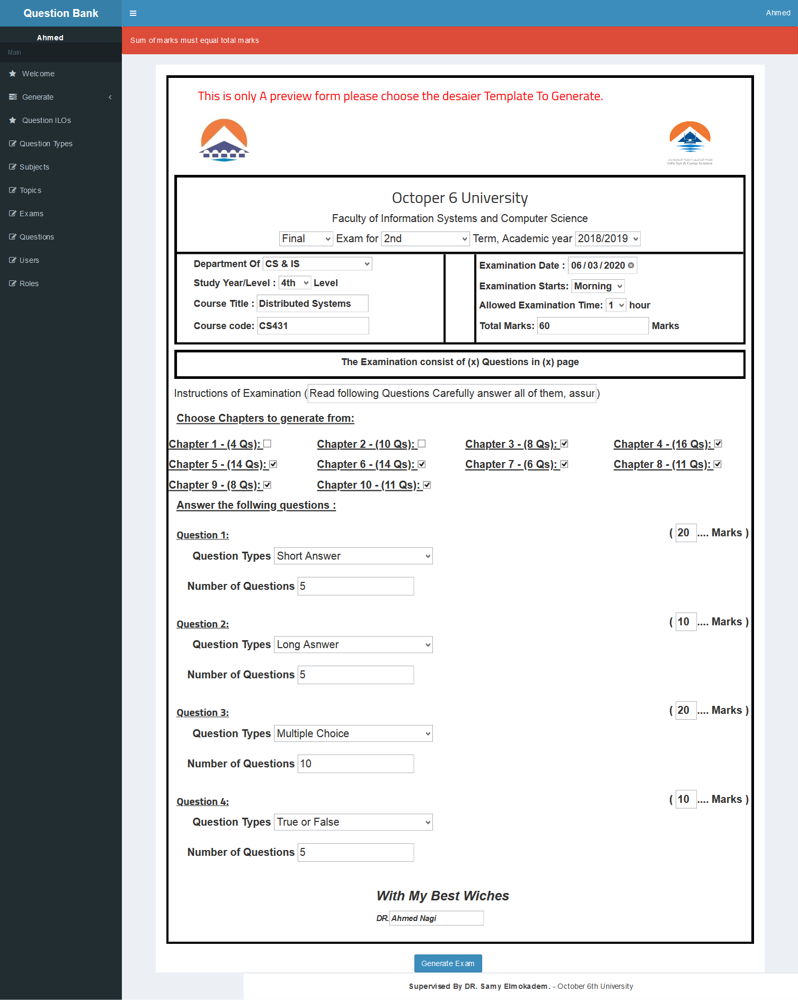
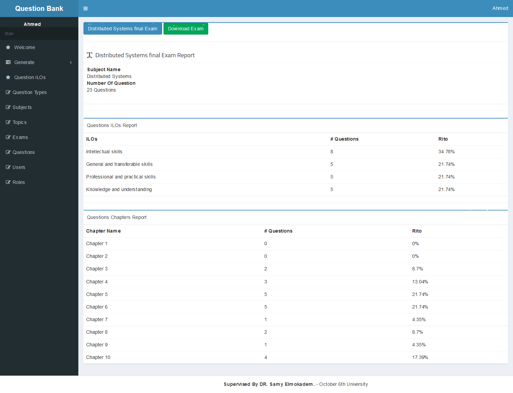
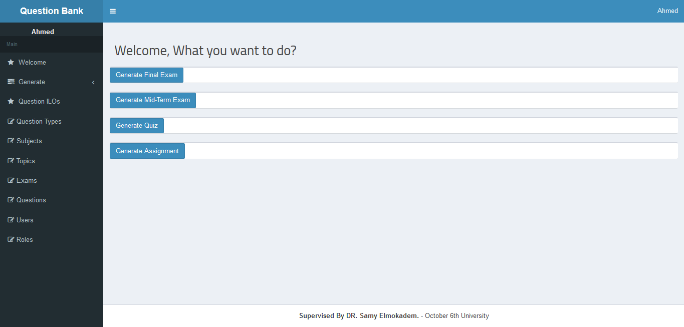

**!!! This repo serves only as a proof of concept, if you're interested in discussing the implementation or turn this into real thing shoot me an email. info@ahmednagi.com**

# Questions Bank

Generate print-ready written exam papers that complies with the institution standards.

## Output exam sample

In the current implementation the output will be in **.docx** format, but for simplicity this sample will be in **.pdf** format.

[Download generated sample](media/final%20Exam%20-%20Distributed%20Systems%202020-06-03.pdf)

---

## Table of Contents

- [Questions Bank](#questions-bank)
  - [Output exam sample](#output-exam-sample)
  - [Screenshots](#screenshots)
  - [Getting started](#getting-started)
  - [ملاحظة AR](#ملاحظة-AR)
  - [Installation](#installation)
  - [Technical details](#technical-details)
    - [phpword](#phpword)
    - [Report generation](#report-generation)


---

## Screenshots





## Getting started

I wrote detailed blog post about the theory **[here](#)** so you can skip for technical details here. You also can download the manual from **[here](media/book.pdf)**.

## ملاحظة AR
تسطيع ايضا قراءة المزيد عن المشروع باللغة العربية من [هنا](https://ahmednagi.com/ar/questions-bank)

او تحميل كتاب الاستخدام للمشروع من [هنا](media/book.pdf)

---

## Installation

```bash
git clone git@github.com:nagi1/questions-bank.git
```

```bash
composer install
```

while composer do it's thing

- Import this **[database.sql](/database.sql)** using your favorite DBMS ex. PHPMyAdmin.

- edit `.env` file with your database credentials

```bash
php artisan serve
```

- use this information to login
- username: admin@admin.com
- password: admin

## Technical details

### phpword

This app built on top of [phpoffice/phpword](https://github.com/PHPOffice/PHPWord) a php package for creating/manipulating Microsoft Word files programmatically.

## Report generation

After generating the exam the app will generate a report containing statistical information about the generated exam.